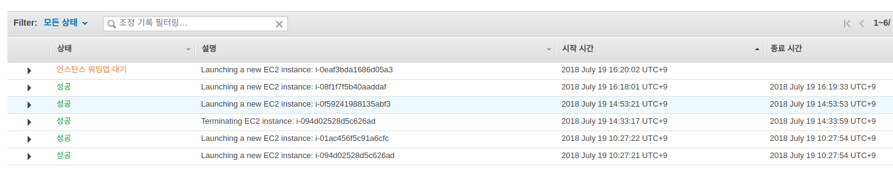

# ECS Autoscaling
## 우여명

---
## 목차

1. ECS 간단 소개
1. 용어 정리
1. 자주 봐야할 페이지지
1. 서비스 오토스케일링
1. 클러스터 오토스케일링
1. 데모
1. 부록

---

## ECS 란
> Amazon Elastic Container Service(ECS)는 확장성이 뛰어난 고성능 컨테이너 오케스트레이션 서비스로서, Docker 컨테이너를 지원하며 AWS에서 컨테이너식 애플리케이션을 쉽게 실행하고 확장 및 축소할 수 있습니다. 
> 
> Amazon ECS를 사용하면 자체 컨테이너 오케스트레이션 소프트웨어를 설치하고 운영할 필요가 없으며, 가상 머신의 클러스터를 관리 및 확장하거나 해당 가상 머신에서 컨테이너를 예약하지 않아도 됩니다.

---

## 용어 정리

### [클러스터 Cluster](https://docs.aws.amazon.com/ko_kr/AmazonECS/latest/developerguide/ECS_clusters.html)
>  작업 요청을 실행할 수 있는 한 개 이상의 컨테이너 인스턴스를 리전별로 그룹화한 것입니다. Amazon EC2 서비스를 처음 사용할 때 각 계정에 기본 클러스터가 생성됩니다. 클러스터는 Amazon EC2 인스턴스 유형을 한 개 이상 포함할 수 있습니다.

컨테이너가 돌아가는 실제 인스턴스들의 묶음!

--- 
### [서비스 Service](https://docs.aws.amazon.com/ko_kr/AmazonECS/latest/developerguide/ecs_services.html)
> Amazon ECS를 사용하여 Amazon ECS 클러스터에서 지정된 수의 작업 정의 인스턴스를 동시에 실행하고 관리할 수 있습니다. 이를 서비스라고 합니다. 어떤 이유로 작업이 실패 또는 중지되는 경우 Amazon ECS 서비스 스케줄러가 작업 정의의 다른 인스턴스를 시작하여 이를 대체하고 사용되는 일정 전략에 따라 서비스의 원하는 작업 수를 유지합니다.
>
>서비스에서 원하는 작업 수를 유지하는 이외에 선택적으로 로드 밸런서를 통해 서비스를 실행할 수 있습니다. 로드 밸런서는 서비스와 연결된 작업 간에 트래픽을 분산합니다.

서비스는 내가 만든 *서비스*에 대한 논리적인 정의

---
### [작업과 작업정의 Task](https://docs.aws.amazon.com/ko_kr/AmazonECS/latest/developerguide/task_definitions.html)
> 작업은 실제로 수행될 한개 이상의 컨테이너에 대한 정의입니다. 작업 정의에서는 작업의 일부가 될 컨테이너의 개수, 컨테이너가 사용할 리소스, 컨테이너 간 연결 방식, 컨테이너가 사용할 호스트 포트와 같은 애플리케이션 관련 컨테이너 정보를 지정합니다.

서비스에서 실행될 한개 이상의 컨테이너에 대한 정의

---
### 오토스케일링 Auto-scaling
> 애플리케이션을 모니터링하고 용량을 자동으로 조정하여, 최대한 저렴한 비용으로 안정적이고 예측 가능한 성능을 유지합니다.

1. 애플리케이션의 특정 지표를 모니터링
1. 특정 지표가 어떤 조건을 만족하면 scale out, scale in

---
### 서비스 조정 정책
#### [대상 추적 조정 정책 Target Tracking Scaling Policies](https://docs.aws.amazon.com/AmazonECS/latest/developerguide/service-autoscaling-targettracking.html)
    
> 특정 측정치에 대한 대상 값을 기준으로 서비스가 실행하는 작업의 수를 늘리거나 줄입니다. 이 과정은 온도 조절기를 사용하여 집안 온도를 유지하는 방법과 비슷합니다. 사용자가 온도를 선택하면 나머지는 모두 온도 조절기에서 자동으로 수행됩니다.

예시) Auto Scaling 그룹의 평균 총 CPU 사용량을 50%로 유지
 
#### [단계 조정 정책 Step Scaling Policies](https://docs.aws.amazon.com/AmazonECS/latest/developerguide/service-autoscaling-stepscaling.html)
>  일련의 조정 조절(경보 위반의 크기에 따라 달라지는 단계 조절)을 기준으로 서비스가 실행하는 작업의 수를 늘리거나 줄입니다.

예시) CPU 사용량이 50% 이상 60% 미만이면 10개의 서비스 추가, 60% 이상 이면 20개 서비스 추가 

---
## 자주 봐야할 페이지

- 클러스트 >서비스 > 이벤트 탭 페이지록
- [Cloudwatch Alarm](https://ap-northeast-2.console.aws.amazon.com/cloudwatch/home?region=ap-northeast-2#alarm:alarmFilter=ANY) 페이지
- [ec2 > auto scaling group](https://ap-northeast-2.console.aws.amazon.com/ec2/autoscaling/home?region=ap-northeast-2#AutoScalingGroups)에서 조정 정책, 활동기록

---
ECS 배포 관련한 것은 아래 링크 참조
- https://github.com/awskrug/handson-labs-2018/tree/master/Container/2_ECS

---

## [서비스 오토스케일링](https://docs.aws.amazon.com/ko_kr/AmazonECS/latest/developerguide/service-auto-scaling.html)

클러스터 내에서 작업(Task)들을 scale out, scale in

우측 상단의 업데이트 버튼!

---

3단계에서 Auto Scaling 

---

정책 추가 및 편집

---

desired count 를 지표에 따라서 변경

---

트래픽이 더 몰려와 작업이 인스턴스에 꽉 차게 되었다.

클러스터 내의 인스턴스가 더 필요하다.

---
## [클러스터 (EC2인스턴스) 오토스케일링](https://docs.aws.amazon.com/ko_kr/autoscaling/ec2/userguide/what-is-amazon-ec2-auto-scaling.html)

클러스터 내에서 EC2 인스턴스들을 scale out, scale in

ec2 > auto scaling 

---

서비스의 50%와 ec2의 50% 이 싱크가 안맞아서 좀 낮게 설정

---

(중요) 최소 용량 2로 설정, 기존은 0인데 잘 잘못하면 모든 인스턴스가 종료될 수 있다.

(중요) 최대값이 그대로 2로 설정되어 있으면 오토스케일링이 되지 않는다.

---

조건에 맞춰서 인스턴스들이 켜지기 시작

---
## 정리
- EC2기반의 ECS Auto-scaling에서는 서비스와 클러스터에 대한 Auto-scaling을 고려해야한다.
- 경험적으로 적당한 정책을 결정한다.
- 인스턴스와 작업이 유기적으로 늘어나고 줄어드는게 포인트!

---
## 부록1. 고민해볼 점
- 작업 배치 전략
- 오토스케일 조건 -> cpu 50%가 최선?
- 대상 추적 정책 vs 단계 조정 정책
- 그냥 컨테이너 하나짜리 서비스라면 EBS를 고려

---
## 부록2. 실패한 사례

### 1. 인스턴스와 작업 1:1로 배포하기

인스턴스가 뜰 때 동시에 작업을 실행하도록 ec2 auto-scaling과 service auto-scaling을 맞추려고 했는데 ec2가 올라오는 속도가 너무 느리고 인스턴스와 작업을 맞추기가 쉽지 않음

그리고 이유는 모르겠지만 ec2 런칭이 안되는 경우가 종종 있음

### 2. 인스턴스가 다 꺼짐

단계 조정 정책으로 scale-in 하도록 했는데 ec2의 최소 용량을 0으로 했더니 다 꺼짐.

---

<!--
우선 메모

오토 스케일링 시도해보기

## 링크
- https://docs.aws.amazon.com/ko_kr/autoscaling/ec2/userguide/as-scaling-simple-step.html

1. 서비스 오토스케일링 설정하기
    - 최소 2개 최대 8개로 설정
    - cpu 50% 이상이면 동작하도록 정책을 만듬
    - 클러스터 인스턴스가 2개밖에 없기 때문에 오토스케일링이 되지 않음.

2. ecs autoscaling group을 찾아서 수정
    - 위와 똑같이 ecs instance(ec2)도  50%로 동작하도록 수정
    -  최대 8개 최소 2개로 수정

3. 문제
    - 줄어들때가 문제.. 줄어들지가 않음..
    

## 나의 시나리오

하나의 인스턴스에 하나의 task만 실행하도록 하려고 합니다. 최소 정상 백분율 50%, 최대 정상 백분율 100% 이렇게 설정했습니다. 저는 지금 오토 스케일링 시나리오를 이렇게 잡았습니다.

1. cpu 50% 이상이면(3분동안 3번 데이터 포인트, cloud watch 알람) ecs cluster instance를 100% 추가
2. 동시에 ecs task 개수도 100% 증가
3. cpu 25% 이하이면(5분동안 5번 데이터 포인트), ecs cluster instance 를 50% 감소
4. 동시에 ecs task 개수도 50% 감소

테스트 중입니다.

지금 어떻게 하면 클러스터의 ec2인스턴스가 올라오거나 내려올때 태스크도 싱크를 잘 맞춰 줄것인가 고민중입니다
운영 환경에서는 오토스케일링 정책의 퍼센트와, 최소, 최대 갯수 등의 하이퍼 파라미터를 어떻게야할지 고민이 될거 같아요
그리고 이상한게 EC2 오토스케일링 정책은 잘 찾는데 ECS 오토스케일링 정책은 가끔 못찾는다고 에러가 나네요 ;;

## 문제들
1. 퍼센트로 할 경우 다 지워짐

## 클러스터 삭제
-->

