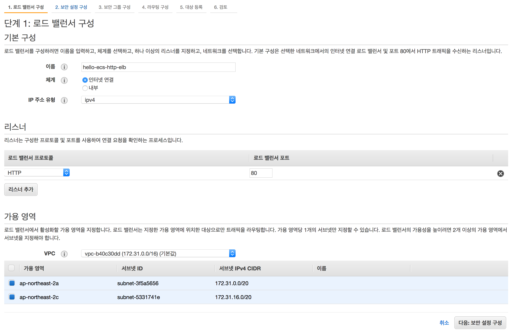
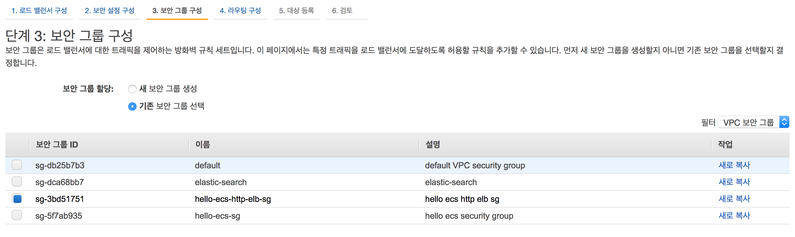
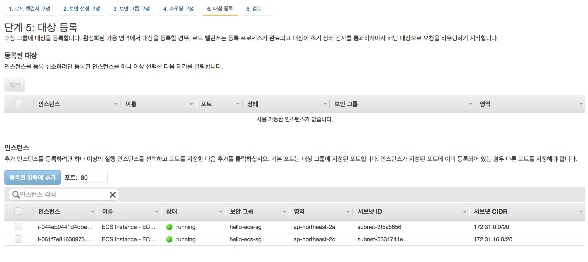

<!-- page_number: false -->

# Elastic Container Service 실습 
### 우 여 명 
[Matholic](http://www.matholic.com)

---
<!-- page_number: true -->
# 발표자 소개

- AWS를 좋아함
- 도커파일로 이미지를 여러개 만들어본 경험 있음
- 도커 스웜을 살짝 해본 경험 있음
- 쿠버네티스 경험 없음
- 회사에서 이번에 ECS를 도입

---


수학 교육 솔루션을 만드는 회사

---
## Elastic Container Service - 도커 기반의 배포 도구

> Amazon Elastic Container Service(ECS)는 확장성이 뛰어난 고성능 컨테이너 오케스트레이션 서비스로서, Docker 컨테이너를 지원하며 AWS에서 컨테이너식 애플리케이션을 쉽게 실행하고 확장 및 축소할 수 있습니다. Amazon ECS를 사용하면 자체 컨테이너 오케스트레이션 소프트웨어를 설치하고 운영할 필요가 없으며, 가상 머신의 클러스터를 관리 및 확장하거나 해당 가상 머신에서 컨테이너를 예약하지 않아도 됩니다.

---
# 실습 목표
- ECR에 도커 이미지를 푸시해본다.
- ECS를 웹 기반 UI에서 실습해본다.
- ECS를 ecs-cli를 기반으로 실습해본다.
- travis-ci와 ecs-cli를 이용해서 CI/CD를 구축해본다.

---
# 실습 준비

- 우선 배포할 서비스 - 스프링부트 hello world!
https://github.com/voyagerwoo/vw.demo.helloworld 

- AWS 루트 권한 유저
- Let's go : https://ap-northeast-2.console.aws.amazon.com/ecs/home?region=ap-northeast-2

---
# WEB console 실습 

---

## 1. ECR(Elastic Container Registry) 만들기
좌측 메뉴바에서 ECR을 클릭한다. 한글로 `리포지토리`라고 되어있다. 그리고 `리포지토리 생성`을 누른다. 이름만 써서 `다음 단계`를 클릭하면 생성된다. 생성되면 docker push 스크립트가 나온다.


---


---

## 2. ECR에 푸시하기
만들어진 repo에는 보통 하나의 도커 이미지를 다른 태그 정보(버전)로 푸시한다. 푸시하는 스크립트는 만들어진 repo에 들어가서 `푸시 명령 보기`를 누르면 확인할 수 있다. 

나는 travis를 활용하여 github에 코드가 푸시되면 자동으로 도커이미지가 빌드되고 ECR에 푸시되도록 설정했다.

<small>[ 참고 ]</small>
<small>https://github.com/voyagerwoo/vw.demo.helloworld/blob/master/.travis.yml</small>

---
## 3. 작업(Task) 정의


---
 컨테이너 추가
<small> :warning: 호스트 포트는 0을 지정한다. 이렇게 되면 호스트 포트는 랜덤한 포트로 지정이 되고 나중에 ELB가 알아서 그 포트로 라우팅 해주게 된다.

만약 포트를 그냥 지정해버리면 업데이트할 때 포트가 충돌이 나서 컨테이너를 모두 stop 했다가 다시 올려야한다.
</small>
 


---
생성!


---


---

## 3. 보안그룹(Security Group) 생성
<small>https://ap-northeast-2.console.aws.amazon.com/ec2/v2/home?region=ap-northeast-2#SecurityGroups:sort=vpcId</small>
미리 보안 그룹을 만들어 둔다. 나중에 ELB를 붙일때 굉장히 편하다.

### 3.1 ELB 용 보안그룹


---
### 3.2 ECS instance용 보안그룹

- 소스는 elb 보안 그룹

---

## 4. ELB와 대상 그룹 생성
<small>https://ap-northeast-2.console.aws.amazon.com/ec2/v2/home?region=ap-northeast-2#LoadBalancers:sort=loadBalancerName</small>

applicaton Load Balancer, HTTP




---
Skip!


---
만들어둔 보안 그룹 선택



---
상태 검사 경로에는 상태 체크용 경로 지정


---
대상 등록은 나중에



---


---


---

## 5. Cluster 생성
잘 모르겠지만 오른쪽은 하면 안될것 같음...


---


---
인스턴스는 두개!


---
보안 그룹은 만들어둔 걸 사용


---


---


---
서비스는 아직 없음


---

### 6. Service 생성


---


---


---


---


---


---


---

### 7. 반영 확인


---

### 8. 웹 콘솔 결론
- 복잡하다.
- 역시 개발자는 코드로
- 그래도 컨셉은 대충 이해할 수 있었다.

---
# ECS CLI 실습

### 준비

- credentials
- [ECS CLI 설치](https://docs.aws.amazon.com/ko_kr/AmazonECS/latest/developerguide/ECS_CLI_installation.html)
- ELB와 대상그룹은 아까처럼 하나더 만들어 둔다. (보안 그룹은 그대로)

---
### 1. configure

```sh
ecs-cli configure --cluster hello-ecs-cli \
  --region ap-northeast-2 \
  --default-launch-type EC2 \
  --config-name hello-ecs-cli

ecs-cli configure profile \
  --access-key ${AWS_ACCESS_KEY_ID} \
  --secret-key ${AWS_SECRET_ACCESS_KEY} \
  --profile-name  hello-ecs-cli
```

--- 
### 2. Cluster 생성
```sh
ecs-cli up --keypair voyager.woo \
  --security-group sg-5f7ab935 \
  --cluster hello-ecs-cli \
  --vpc vpc-b40c30dd \
  --subnets subnet-5331741e,subnet-3f5a5656 \
  --capability-iam --size 2 \
  --instance-type t2.medium
```

:warning: security group은 이름이 아닌 id로 넣어야한다! 이름을 넣으면 클러스터는 생기는데 인스턴스가 안생김...

---
### 3. Task를 정의하는 docker compose 작성
<small>

```
version: '2'
services:
  hello-ecs-app:
    image: ${ECR_HOST}/hello-ecs:latest
    cpu_shares: 100
    mem_limit: 524288000
    ports:
      - "0:9460"
    logging:
      driver: awslogs
      options:
        awslogs-group: hello-ecs-cli
        awslogs-region: ap-northeast-2
        awslogs-stream-prefix: wordpress
```
</small>

---
### 4. compose test

```
# test compose container up
ecs-cli compose --file hello-compose.yml up \
  --create-log-groups --cluster hello-ecs-cli

# test compose scale up
ecs-cli compose --file hello-compose.yml scale 2 \
  --cluster hello-ecs-cli

# shutdown compose container
ecs-cli compose --file hello-compose.yml down \
  --cluster hello-ecs-cli
```

---
### 5. Service 생성
만들어둔 대상 그룹의 ARN 으로 Load balancer에 연결한다.

```sh
# 서비스 생성
ecs-cli compose --file hello-compose.yml service \
  create --cluster hello-ecs-cli \
  --deployment-max-percent 200 \
  --deployment-min-healthy-percent 50 \
  --target-group-arn "${TARGET_GROUP_ARN}" \
  --health-check-grace-period 30 \
  --container-name hello-ecs-app \
  --container-port 9460 \
  --create-log-groups 
```
---

### 6. Service 실행

서비스를 띄우고 컨테이너 개수를 2개로 늘린다.

<small>

```
ecs-cli compose --file hello-compose.yml service up \
  --cluster hello-ecs-cli

ecs-cli compose --file hello-compose.yml service scale 2 \
  --cluster hello-ecs-cli 
```
</small>


### 7. Service 업데이트

<small>

```
ecs-cli compose --file hello-compose.yml service up \
  --cluster hello-ecs-cli --force-deployment
```
</small>