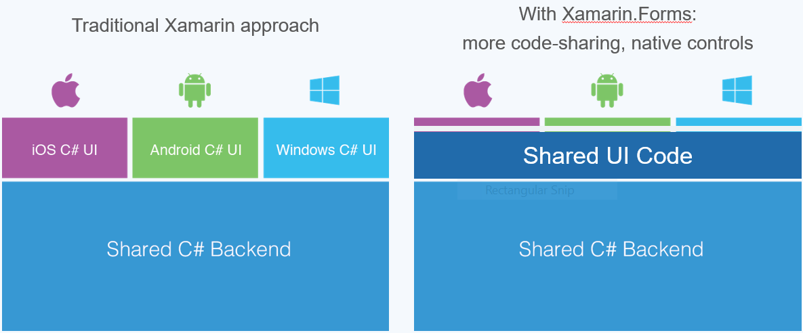
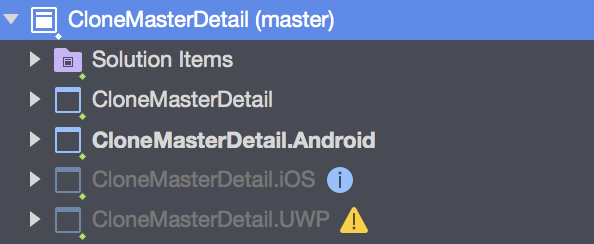
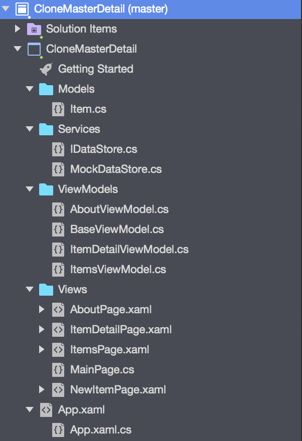
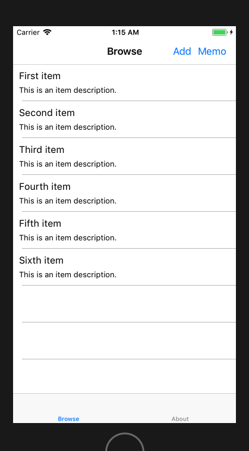
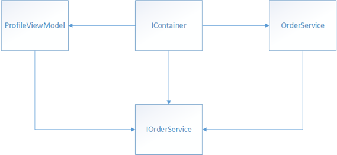

# Xamarin 파보기

[신림프로그래머](https://www.facebook.com/groups/767987643241037/) / [매쓰홀릭](https://www.matholic.com) 우여명 
<!-- page_number: true -->

---
# 발표자 소개

<div style="font-size:70%">

>  https://github.com/voyagerwoo
>  http://reimaginer.tistory.com
</div>

<div style="font-size:90%">

- 만 3년이 지나 4년을 향해가는 개발자
- `안정성`, `생산성`, `흥미` 이 세가지를 모두 만족시키기 위해 고민하는 사람
- `java`와 `javascript`가 제일 편한 사람
- 앱 만들어 본 경험은 최근에 윈도우 UWP 앱 이외에 없음
- `.NET` 및 `C#` 경험이 이번이 처음
 
</div>

---
# 목차
- Xamarin을 시작하게 된 이유
- Xamarin 소개
- Xamarin Forms 란
- Xamarin Forms 기본 프로젝트 코드 살펴보기
- 플랫폼별로 UI 작성하기 및 네이티브 기능 사용하기
- 데모
- 관심이 시들해진 이유
- 모바일 개발에 대한 앞으로의 계획

---
# Xamarin을 시작하게 된 이유
- 필요에 의해서 만들어본 [Universial Windows Platform](https://docs.microsoft.com/ko-kr/windows/uwp/get-started/whats-a-uwp) App
- UWP 앱 개발에 약간 감동 :thumbsup:
  - `C#`, `XAML`, `MVVM`, `Nuget`
- Xamarin도 왠지 좋을거 같아!

---
# [Xamarin](https://www.xamarin.com/) 
> ### Deliver native Android, iOS, and Windows apps, using <span style="color:red">existing skills, teams, and code.</span>


만약 `C#`을 주로 하는 회사라면... :thumbsup:

---
# [Xamarin](https://www.xamarin.com/)
### Build native apps for multiple platforms on a shared <span style="color:red">C# codebase</span>. Use the same IDE, language, and APIs everywhere.
- Native UI, native API access, and native performance
- Anything you can do in Objective-C, Swift, or Java you can do in C# with Xamarin
- Ship cutting-edge apps with same-day support for new OS releases

---
# [Xamarin Forms](https://www.xamarin.com/forms)
- 윈도우, iOS, Android 여러 플랫폼에서 공유하는 코드
- <span style="color:red">앱의 흐름을 추상화한 고수준 프로젝트</span>
- `C#` 또는 `XAML`로 작성
- 일반적인 UI 구현이 가능
  - Forms 만으로 크로스 플랫폼 앱을 만들 수 있다.

> Use the Xamarin.Forms API to quickly build native apps for iOS, Android and Windows completely in C#. We built the above CRM app with Xamarin.Forms with <span style="color:red">over 96% code sharing across platforms.</span>
---
# Xamarin Forms Structure

Xamarin Forms를 통해서 UI 코드와 C# 앱 로직 코드를 공유한다.


---
# 기본 앱 프로젝트 구조
- `repo` : https://github.com/helloxamarin/CloneMasterDetail

  

- CloneMasterDetail 솔루션 하위의 CloneMasterDetail 프로젝트가 Forms 프로젝트
- 각 플랫폼별 프로젝트가 Forms 프로젝트를 참조한다.

---
# Xamarin Forms 구조

<div style="content:'';display:block;clear:both">
  <div style="float:left;width:40%">
  
  </div>
  <div style="float:right;width:60%;font-size:90%;">
  
- `Models`: 데이터
- `Services`: 비즈니스 로직 수행
- `ViewModels`: View에 바인딩되는 데이터
- `Views` : Xaml 또는 C#으로 기술된 View
- `App.xaml` : 자마린 폼즈의 시작점. <br>플랫폼별 프로젝트들이 이 코드를 실행한다.
  
  </div>
</div>


---
<div style="font-size:60%">

# Android의 경우
`MainActivity`에서 XamarinForms 앱을 로드한다.


```c#
using Android.App;
using Android.Content.PM;
using Android.OS;

namespace CloneMasterDetail.Droid
{
    [Activity (Label = "CloneMasterDetail", 
               Icon = "@drawable/icon", 
               Theme="@style/MainTheme", 
               MainLauncher = true, 
               ConfigurationChanges = ConfigChanges.ScreenSize | ConfigChanges.Orientation)]
    public class MainActivity : global::Xamarin.Forms.Platform.Android.FormsAppCompatActivity
    {
        protected override void OnCreate (Bundle bundle)
        {
            TabLayoutResource = Resource.Layout.Tabbar;
            ToolbarResource = Resource.Layout.Toolbar; 

            base.OnCreate (bundle);

            global::Xamarin.Forms.Forms.Init (this, bundle);
            LoadApplication (new CloneMasterDetail.App ());
        }
    }
}
```
</div>

---
<div style="font-size:80%">

# [UI Controls](https://developer.xamarin.com/guides/xamarin-forms/user-interface/controls/)
- [Pages](https://developer.xamarin.com/guides/xamarin-forms/user-interface/controls/pages/) : 앱의 페이지. iOS의 ViewController, UWP의 페이지와 같은 개념이지만, Android의 액티비티와는 다르다.
  - ex : `ContentPage`
- [Layouts](https://developer.xamarin.com/guides/xamarin-forms/user-interface/controls/layouts/) : 담고 있는 컴포넌트의 위치나 크기 등의 레이아웃을 표현한다. 
  - ex : `StackLayout`, `Grid`
- [Views](https://developer.xamarin.com/guides/xamarin-forms/user-interface/controls/views/) : 버튼이나 레이블, 인풋박스  등의 컴포넌트를 뷰라고 한다. 
  - ex : `Label`, `Button`, `ListView`
- [Cells](https://developer.xamarin.com/guides/xamarin-forms/user-interface/controls/cells/) : 테이블 등에서 항목 등을 표현하는 템플릿
  - ex : `ViewCell`
</div>
<div style="font-size:60%">
<br>
<br>

왜 컨트롤이라고 할까? https://msdn.microsoft.com/en-us/library/0b1dk63b.aspx?f=255&mspperror=-2147217396#Anchor_1
</div>

---
<div style="font-size:56%">

# UI 예제 코드
<div style="content:'';display:block;clear:both">
  <div style="float:left;width:72%">
  
  ```xaml
<?xml version="1.0" encoding="utf-8" ?>
<ContentPage xmlns="http://xamarin.com/schemas/2014/forms"
             xmlns:x="http://schemas.microsoft.com/winfx/2009/xaml"
             x:Class="CloneMasterDetail.Views.ItemsPage"
             Title="{Binding Title}"
             x:Name="BrowseItemsPage">
    <ContentPage.ToolbarItems>
      <ToolbarItem Text="Add" Clicked="AddItem_OnClicked"></ToolbarItem>
      <ToolbarItem Text="Memo" Clicked="MemoItem_OnClicked"></ToolbarItem>
    </ContentPage.ToolbarItems>
    <ContentPage.Content>
      <StackLayout>
        <ListView x:Name="ItemsListView"
                  ItemsSource="{Binding Items}"
                  VerticalOptions="FillAndExpand"
                  HasUnevenRows="True"
                  RefreshCommand="{Binding LoadItemsCommand}"
                  IsPullToRefreshEnabled="True"
                  IsRefreshing="{Binding IsBusy, Mode=OneWay}"
                  CachingStrategy="RecycleElement"
                  ItemSelected="ItemsListView_OnItemSelected">
          <ListView.ItemTemplate>
            <DataTemplate>
              <ViewCell>
                <StackLayout Padding="10">
                  <Label Text="{Binding Text}" 
                         LineBreakMode="NoWrap"
                         Style="{DynamicResource ListItemTextStyle}"
                         FontSize="16"/>
                  <Label Text="{Binding Description}"
                         LineBreakMode="NoWrap"
                         Style="{DynamicResource ListItemDetailTextStyle}"
                         FontSize="13"/>
                </StackLayout>
              </ViewCell>
            </DataTemplate>
          </ListView.ItemTemplate>
        </ListView>
      </StackLayout>
    </ContentPage.Content>
</ContentPage>
```
  
  </div>
  <div style="float:right;width:28%;">
  	
  </div>
</div>


</div>

---
# 하지만 현실에선 Forms만으론 어렵다
결국 플랫폼별로 분기를 해야하는 일이 발생한다.
## 플랫폼별 UI 작성 방법 세가지
1. 플랫폼 별 UI 속성 설정 :white_check_mark:
2. Custom Renderer :white_check_mark:
3. Effect

---
# 플랫폼 별 UI 속성 설정
<div style="font-size:90%">

`OnPlatform`을 통해서 플랫폼 별로 스타일 등의 속성을 정의할 수 있다.

</div>
<div style="font-size:80%">

```xaml
<?xml version="1.0" encoding="utf-8" ?>
<ContentPage xmlns="http://xamarin.com/schemas/2014/forms"
             xmlns:x="http://schemas.microsoft.com/winfx/2009/xaml"
             x:Class="CloneMasterDetail.Views.ItemDetailPage"
             Title="{Binding Title}">
    <ContentPage.Padding>
        <OnPlatform x:TypeArguments="Thickness" x:Key="PagePadding">
            <On Platform="iOS" Value="0,20,0,0"/>
        </OnPlatform>
    </ContentPage.Padding>
    <StackLayout Spacing="20" Padding="15">
        <Label Text="{Binding Item.Text}" FontSize="Medium"/>
        <Label Text="{Binding Item.Description}" FontSize="Small"/>
    </StackLayout>
</ContentPage>
```
</div>


---
# [Custom Renderer](https://developer.xamarin.com/guides/xamarin-forms/application-fundamentals/custom-renderer/)
> Xamarin.Forms user interfaces are rendered using the native controls of the target platform, allowing Xamarin.Forms applications to retain the appropriate look and feel for each platform. 
> Custom Renderers let developers <span style="color:red">override</span> this process to customize the appearance and behavior of Xamarin.Forms controls on <span style="color:red">each platform</span>.

---
<div style="font-size:70%">

# Custom Renderer 1 - Forms.UnderlineLabel
- Xamarin Forms 프로젝트에서 탭(클릭) 가능한 라벨 컨트롤을 만든다.
- 밑줄을 긋는 코드는 각 플랫폼에서 네이티브 기능으로 구현한다.

```c#
using System;
using Xamarin.Forms;

namespace CloneMasterDetail.Views.Components
{
    public class UnderlineLabel : Label
    {
        public event EventHandler Tapped;

        public UnderlineLabel()
        {
            var tabGestureRecognizer = new TapGestureRecognizer();
            tabGestureRecognizer.Tapped += (sender, args) => RaiseTapped();
            GestureRecognizers.Add(tabGestureRecognizer);
        }

        public void RaiseTapped() => Tapped?.Invoke(this, EventArgs.Empty);
    }
}
```
</div>

---
<div style="font-size:65%">

# Custom Renderer 1 - UWP.UnderlineLabelRenderer
- UWP 네이티브 프로젝트에 렌더러 코드 작성
- `[assembly: ExportRenderer(typeof(UnderlineLabel), typeof(UnderlineLabelRenderer))]`
  - 이 코드를 통해서 렌더러와 렌더링 될 타겟을 정의
```c#
using Windows.UI.Xaml.Controls;
using Windows.UI.Xaml.Documents;
using CloneMasterDetail.UWP.Renderers;
using CloneMasterDetail.Views.Components;
using Xamarin.Forms;
using Xamarin.Forms.Platform.UWP;

[assembly: ExportRenderer
    (typeof(UnderlineLabel), typeof(UnderlineLabelRenderer))]
namespace CloneMasterDetail.UWP.Renderers
{
    public class UnderlineLabelRenderer : LabelRenderer
    {
        protected override void OnElementChanged(ElementChangedEventArgs<Label> e)
        {
            base.OnElementChanged(e);
            if (!(Control is TextBlock control)) return;
            var underline = new Underline();
            var run = new Run {Text = control.Text};
            control.Text = "";
            control.Inlines.Clear();
            underline.Inlines.Add(run);
            control.Inlines.Add(underline);
        }
    }
}
```
</div>

---
<div style="font-size:75%">

# Custom Renderer 2 - Forms.MemoPage
- 페이지 자체를 네이티브에서 정의하기 위해서 빈 페이지를 만든다.
- 지원하지 않는 플랫폼도 있을 예정.

```c#
using Xamarin.Forms;

namespace CloneMasterDetail.Views
{
    public class MemoPage : ContentPage
    {
        public MemoPage ()
        {
            Content = new StackLayout {
                Children = {
                    new Label { Text = "Unsupported Page" }
                }
            };
        }
    }
}
```
</div>

---
<div style="font-size:69%">

# Custom Renderer 2 - UWP.PencilPageRenderer
- 네이티브로 정의된 InkCanvasPage를 `setNativeControl` 메서드를 통해서 설정
```c#
using CloneMasterDetail.UWP.Renderers;
using CloneMasterDetail.Views;
using Xamarin.Forms;
using Xamarin.Forms.Platform.UWP;

[assembly: ExportRenderer(typeof(MemoPage), typeof(MemoPageRenderer))]
namespace CloneMasterDetail.UWP.Renderers
{
    public class MemoPageRenderer : PageRenderer
    {
        protected override void OnElementChanged(ElementChangedEventArgs<Page> e)
        {
            base.OnElementChanged(e);

            if (e.NewElement is ContentPage element)
                element.Content = null;
            
            this.SetNativeControl(new InkCanvasMemoPage());
        }
    }
}
```
</div>

---
<div style="font-size:80%">

# 네이티브 기능 사용
- 의존성 주입, 의존성 역전 패턴을 이용한다.

  
- Xamarin Forms 에서는 인터페이스를 정의하고 각 플랫폼 별로 네이티브 기능의 인터페이스 구현체를 만든 다음 [DependencyService](https://developer.xamarin.com/guides/xamarin-forms/application-fundamentals/dependency-service/introduction/)에 등록해둔다.
- 그럼 Xamarin Forms 에서는 `DependencyService.Get<ITextToSpeech>()` 이런 방식으로 가져와서 실행하기만 하면된다.
- 각 플랫폼 별 구현체가 무엇인지 알 필요가 없다.
</div>

---

<div style="font-size:80%">

# 네이티브 기능 인터페이스 정의하고 사용 - Forms

```c#
namespace CloneMasterDetail.Services
{
    public interface ITextToSpeech
    {
        void Speak(string text);
    }
}
```
```
private void UnderlineLabel_Tapped(object sender, EventArgs e)
{
    if (sender is UnderlineLabel label)
    {
         DependencyService.Get<ITextToSpeech>().Speak(label.Text);
    }
}
```
</div>

---
<div style="font-size:75%">

# 네이티브 기능 구현 - iOS
- `[assembly: Dependency(typeof(TextToSpeechImpl))]`
  - 이 코드를 통해 DependencyService Container에 객체가 담긴다.
```using AVFoundation;
using CloneMasterDetail.Services;
using CloneMasterDetail.iOS.Services;
using Xamarin.Forms;

[assembly: Dependency(typeof(TextToSpeechImpl))]
namespace CloneMasterDetail.iOS.Services
{
    public class TextToSpeechImpl : ITextToSpeech
    {
        public void Speak(string text)
        {
            var speechSynthesizer = new AVSpeechSynthesizer();
            var speechUtterance = new AVSpeechUtterance(text)
            {
                Rate = AVSpeechUtterance.MaximumSpeechRate / 4,
                Voice = AVSpeechSynthesisVoice.FromLanguage("en-US"),
                Volume = 0.5f,
                PitchMultiplier = 1.0f
            };

            speechSynthesizer.SpeakUtterance(speechUtterance);
        }
    }
}
```
</div>

---
# 데모

---
# Xaramin Forms 결론
- 대부분의 일반적인 UI를 표현할 수 있다.
- 표현할 수 없는 UI - View 또는 Page는 각 플랫폼 별로 Renderer를 통해서 재정의(override) 할 수 있다. 
- 네이티브 기능은 인터페이스를 정의하고 각 플랫폼 별로 구현체를 DependencyService를 통해서 가져와 사용할 수 있다.
- 즉, 일반적인 UI와 추상화된 앱의 흐름을 정의할 수 있다.


---
# 관심이 시들해진 (감정적인) 이유
- 왤케 뭐가 되다 안되다 하지.. (특히 맥에서)
- 맥북이랑 윈도우랑 툴이 왜이렇게 다르지..
- 결국 iOS랑 Android 봐야겠네...
- 깃헙 스타수 왤케 적음 ...

---
# 결국 안드로이드를 공부하기로

---
# 모바일 개발에 대한 앞으로의 계획
  
- Android 및 iOS 공부
- react native 
  - 우리팀이 리엑트를 잘하니까!
  - getting started는 아주 간단하고 맘에 들었음.

---
# (개인적인) 결론
- 일반적인 UI를 하나의 코드로 구현하는 것은 상당히 매력적이다.
- 그러나 앱을 개발하다보면 네이티브 기능을 사용해야하고, 네이티브 영역의 많은 문제를 해결해야한다. 그래서 네이티브를 알아야한다.
- 모바일 개발을 위해서는 자바, c#, Object C, swift 등 언어 보다는 해당 플랫폼의 API를 잘 알아야한다.
- <span style="color:red">`Xamarin`을 하든 `react-native`를 하든 네이티브를 공부해야 한다.</span>
- 안드로이드 책을 보자...


---
<div style="font-size:100%"> 

# 참고 자료
- 이규원님의 Xamarin 초보를 넘어서기 위한 필수 스킬 https://channel9.msdn.com/Events/Channel9-Korea/Xamarin/Xamarin-Beginners-Skills
- Xamarin 공식 가이드 : https://developer.xamarin.com/guides/
- https://www.sitepoint.com/build-cross-platform-android-ios-uis-xamarin-forms/
</div>

---
<div style="font-size:200%"> 

# 감사합니다.

</div>